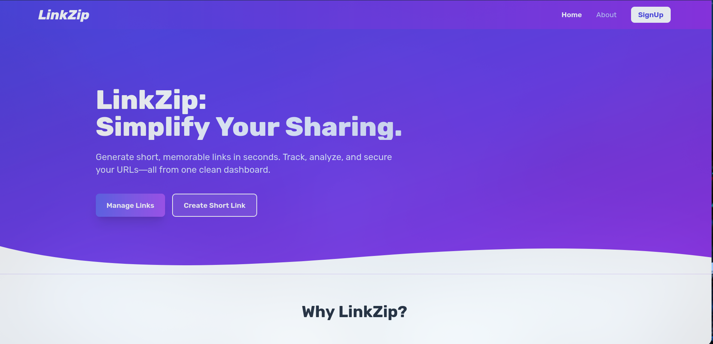
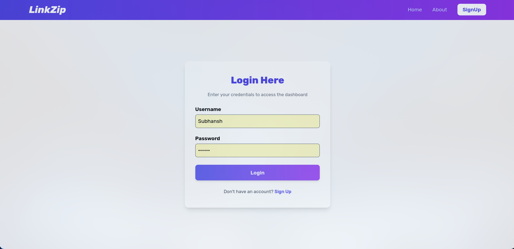
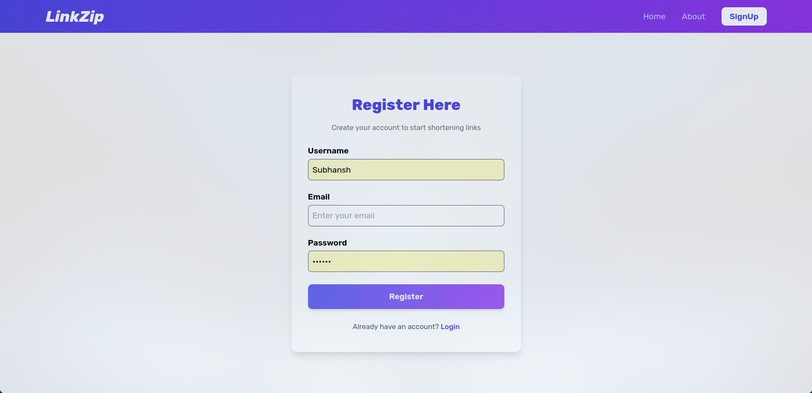
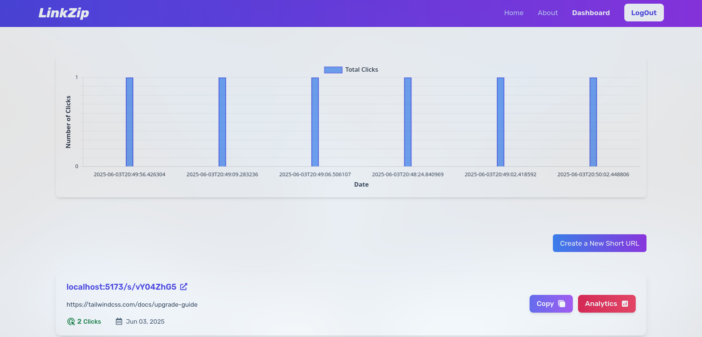

# LinkZip - URL Shortener with Analytics


**LinkZip** is a modern, secure, and user-friendly URL shortener that simplifies link sharing while providing powerful analytics to track link performance. Built with a robust Spring Boot backend and a sleek React frontend, LinkZip allows users to create short URLs, manage them via a dashboard, and gain insights into click counts, locations, and referral sources. Whether you're a marketer, developer, or casual user, LinkZip makes URL management effortless and insightful.

---

## 🌟 Features

- **URL Shortening**: Create short, memorable URLs in seconds with a single click.
    
- **Powerful Analytics**: Track clicks, geographic locations, and referral sources through an intuitive dashboard.
    
- **User Authentication**: Secure user registration and login using JWT-based authentication.
    
- **Responsive Design**: A mobile-friendly interface built with React and Tailwind CSS for seamless use across devices.
    
- **Enhanced Security**: Passwords are hashed with BCrypt, and APIs are protected with Spring Security and JWT.
    
- **Fast Redirects**: Lightning-fast URL redirects powered by a globally distributed backend.
    
- **Error Handling**: User-friendly error pages for invalid requests or server issues.
    

---

## 📸 Screenshots

|   |   |   |   |
|---|---|---|---|
|**Landing Page**|**Dashboard**|**Login Page**|**Register Page**|
|||||

---

## 🛠️ Tech Stack

### Backend

- **Spring Boot**: For building a robust REST API.
    
- **Spring Security**: For JWT-based authentication and authorization.
    
- **JJWT (JSON Web Token)**: For secure token generation and validation.
    
- **BCrypt**: For password hashing.
    
- **MySQL/PostgreSQL**: For storing user data and URL mappings (configurable).
    
- **Maven**: For dependency management.
    

### Frontend

- **React**: For a dynamic and responsive user interface.
    
- **React Router**: For client-side routing.
    
- **Tailwind CSS**: For modern and utility-first styling.
    
- **Framer Motion**: For smooth animations.
    
- **React Hook Form**: For form validation and management.
    
- **React Hot Toast**: For user-friendly notifications.
    
- **React Icons**: For scalable vector icons.
    
- **Axios**: For making API requests.
    

### Others

- **Vite**: For fast frontend build and development.
    
- **Context API**: For state management in React.
    
- **Git**: For version control.
    
- **GitHub**: For hosting the repository.
    

---

## 🚀 Getting Started

Follow these steps to set up and run LinkZip locally.

### Prerequisites

- **Java 17** or higher
    
- **Node.js 18** or higher
    
- **MySQL/PostgreSQL** (or any preferred database)
    
- **Git** (for cloning the repository)
    

### Installation

1. **Clone the Repository**:
    
    ```bash
    git clone https://github.com/your-username/linkzip.git
    cd linkzip
    ```
    
2. **Backend Setup**:
    
    - Navigate to the backend directory:
        
        ```bash
        cd backend
        ```
        
    - Configure the database in application.properties:
        
        ```properties
        spring.datasource.url=jdbc:mysql://localhost:3306/linkzip
        spring.datasource.username=root
        spring.datasource.password=your-password
        spring.jpa.hibernate.ddl-auto=update
        jwt.secret=your-jwt-secret
        jwt.expirationMs=86400000
        ```
        
    - Build and run the Spring Boot application:
        
        ```bash
        mvn clean install
        mvn spring-boot:run
        ```
        
    - The backend will run on http://localhost:8080.
        
3. **Frontend Setup**:
    
    - Navigate to the frontend directory:
        
        ```bash
        cd frontend
        ```
        
    - Install dependencies:
        
        ```bash
        npm install
        ```
        
    - Configure the backend URL in .env:
        
        ```env
        VITE_BACKEND_URL=http://localhost:8080
        ```
        
    - Start the React development server:
        
        ```bash
        npm run dev
        ```
        
    - The frontend will run on http://localhost:5173.
        
4. **Access the Application**:
    
    - Open http://localhost:5173 in your browser.
        
    - Register a new account or log in to start shortening URLs.
        

---

## 📚 API Endpoints

|   |   |   |   |
|---|---|---|---|
|Method|Endpoint|Description|Authentication|
|POST|/api/auth/public/register|Register a new user|None|
|POST|/api/auth/public/login|Log in and get JWT token|None|
|POST|/api/urls/create|Create a short URL|JWT Required|
|GET|/api/urls/list|Get list of user's URLs|JWT Required|
|GET|/{shortUrl}|Redirect to original URL|None|

_Note_: Protected endpoints require a JWT token in the Authorization header (Bearer <token>).

---

## 📊 Analytics Dashboard

LinkZip's analytics dashboard provides:

- **Click Counts**: Total number of clicks on each short URL.
    
- **Total Click Analytics**: Total no of clicks on URLs made by the user.
    
- **Referral Sources**: Websites or apps driving traffic to your links.
    
- **Time-Based Insights**: Click patterns over time (daily, weekly, monthly).
    

_Screenshot_:



---

## 🧑‍💻 Usage

1. **Register**: Create an account on the /register page.
    
2. **Log In**: Use your credentials to log in at /login.
    
3. **Create Short URLs**: Navigate to the dashboard and use the "Create Short Link" feature.
    
4. **Track Analytics**: View detailed insights on your dashboard.
    
5. **Share Links**: Share short URLs anywhere, and they’ll redirect to the original URL.
    

---

## 🤝 Contributing

Contributions are welcome! To contribute:

1. Fork the repository.
    
2. Create a new branch (git checkout -b feature/your-feature).
    
3. Make your changes and commit (git commit -m 'Add your feature').
    
4. Push to the branch (git push origin feature/your-feature).
    
5. Open a Pull Request.
    

---

## 📝 License

This project is licensed under the MIT License. See the LICENSE file for details.

---

## 📬 Contact

For questions or feedback, reach out to:

- **Your Name**: your.email@example.com
    
- **GitHub**: your-username
    
- **LinkedIn**: your-linkedin-profile
    

---

## 🙌 Acknowledgments

- Thanks to Spring Boot and React for amazing frameworks.
    
- Inspired by popular URL shorteners like Bitly and TinyURL.
    
- Icons by React Icons.
    
- Animations powered by Framer Motion.
    

---

_Built with 💻 and ☕ by [Your Name]. Ready to simplify your links? Try LinkZip today!_
